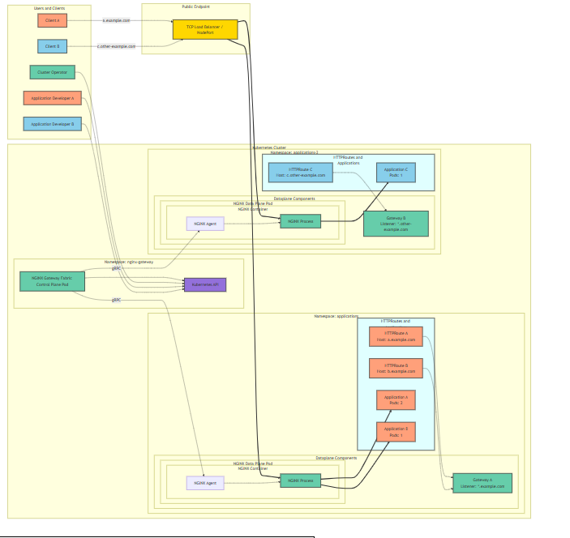

# migration-vers-gateway-api
## 1. Installation du gateway api crd
```bash
kubectl apply --server-side -f https://github.com/kubernetes-sigs/gateway-api/releases/download/v1.5.0/standard-install.yaml

```
from 
https://gateway-api.sigs.k8s.io/guides/getting-started/#installing-a-gateway-controller


## installation du crds du providers
for nginx fabric 

https://docs.nginx.com/nginx-gateway-fabric/get-started 
https://docs.nginx.com/nginx-gateway-fabric/install/helm/ 

```bash
helm install ngf oci://ghcr.io/nginx/charts/nginx-gateway-fabric --create-namespace -n nginx-gateway
```

and to custom the deployement you have to run the following command
```bash
helm install ngf oci://ghcr.io/nginx/charts/nginx-gateway-fabric --create-namespace -n nginx-gateway --set nginx.service.type=NodePort 
```

## how gateway api works :


## architecture of nginx fabric


## How the gateway api differs from ingress controller: